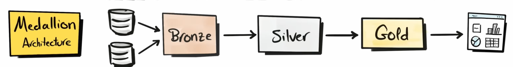

# Data Warehouse project

This project demonstrates a **comprehensive** data warehousing workflow, from building a data warehouse to generating actionable insights.

It highlights industry best practices in data engineering and analytics.

</aside>

<aside>

## Project Requirement:

#### building a Data Warehouse

objectives:

develop a modern data warehouse using sql server to consolisate sales data, enabling analytical reporting and informed decision-making.

Specifications:

1. data scources: two data sources (ERP,CRM) as CSV files
2. data quality
3. integration
4. scope: no historization needed
5. documentation

#### BI: Analytical & reporting:

objectives:

develop SQL-based analytics to deliver detailed insights into stakeholders

</aside>

|  | **bronze layer** | **silver layer** | **gold layer** |
| --- | --- | --- | --- |
| **definition** | the raw data(as-is) | clean and transformed data | data marts |
| obj | traceability & debugging | prepare data for analysis | for reporting |
| **object type** | tables | tables | views |
| l**oad method** | full load (truncate & insert) | full load (truncate & insert) | none |
| **transformation** | none |   1. cleaniing
  2. standardization
  3. normalization
  4. enrichment |   • integration
  •  aggregation
  • business logic & rules |
| **data modelling** | none | none |   • schema
  • aggregated objects
  • flat tables |

Data Architecture

ETL process

ETL process

Naming conventions

<aside>

using snake_case for naming conventions

Table naming conventions: 

- bronze → <source>_<entity> like: crm_customer_info
- silver → <source>_<entity> like: crm_customer_info
- gold → <type>_<entity> like: dim_customers
</aside>

data integraion

Data Model

Data Flow through the source & 3 layers

