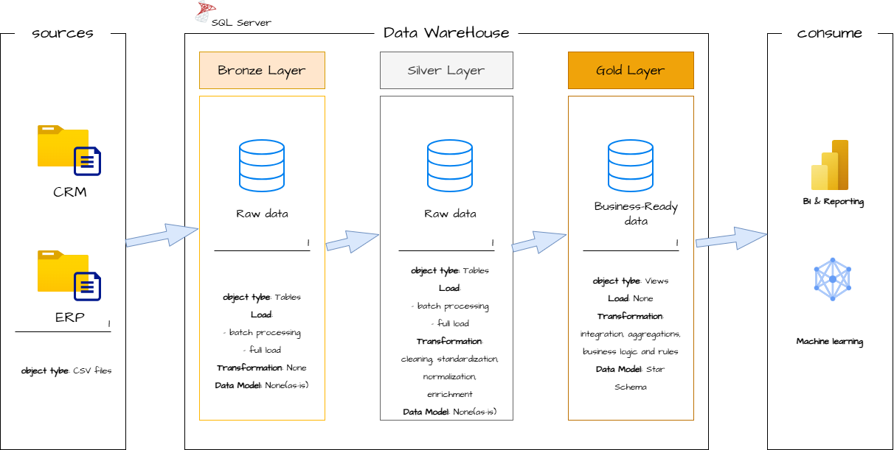
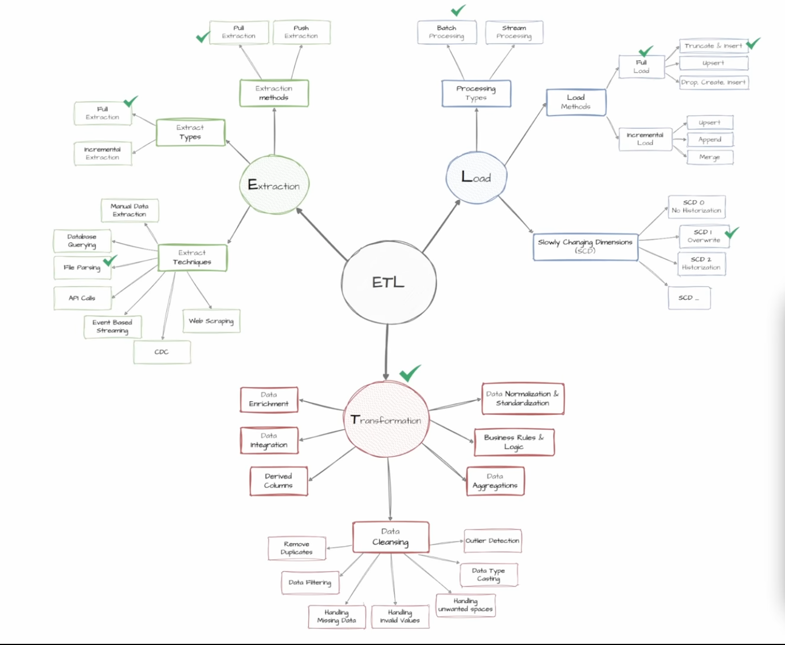
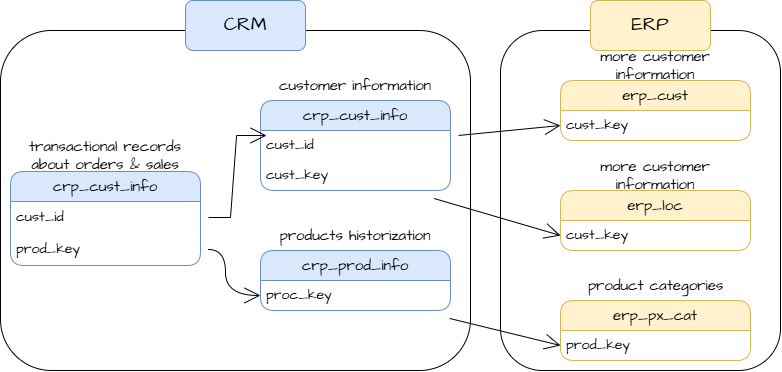
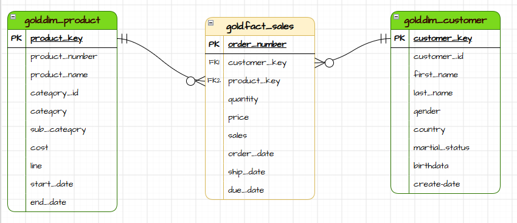
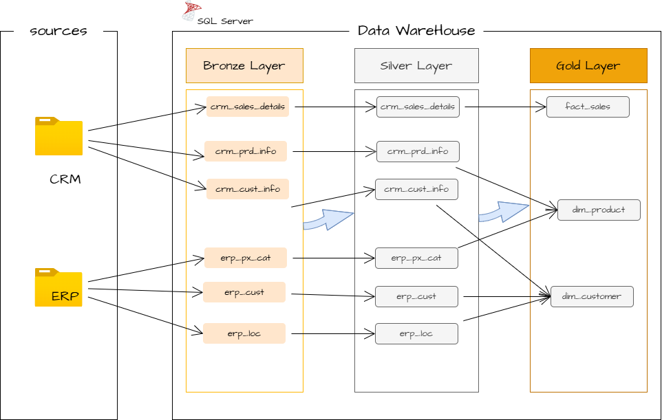

# 🏗️ Data Warehouse Project

This project demonstrates a **comprehensive data warehousing workflow**, from building a data warehouse to generating actionable business insights. It highlights industry best practices in data engineering and analytics.

Built entirely on **SQL Server**, the project consolidates raw sales data from two source systems (**CRM** and **ERP**) into a layered warehouse (Bronze → Silver → Gold) following the **Medallion Architecture**, then exposes a clean **Star Schema** in the Gold layer, ready for BI reporting and machine learning use cases.

---

## 📂 Repository Structure

```
Sales-Warehouse/
│
├── datasets/       # Raw source CSV files (CRM & ERP)
├── documents/       # Diagrams & documentation assets (architecture, data model, ETL, etc.)
├── scripts/       # SQL scripts for building Bronze, Silver, and Gold layers
├── tests/       # Data quality checks
└── README.md
```

---

## 📋 Project Requirements

### 1️⃣ Building the Data Warehouse

**Objective:**
Develop a modern data warehouse using SQL Server to consolidate sales data, enabling analytical reporting and informed decision-making.

**Specifications:**

| # | Requirement | Details |
|---|---|---|
| 1 | Data Sources | Two data sources (ERP, CRM), provided as CSV files |
| 2 | Data Quality | Cleanse and resolve data quality issues prior to analysis |
| 3 | Integration | Combine both sources into a single, user-friendly data model designed for analytical queries |
| 4 | Scope | Focus on the latest dataset only; historization of data is not required |
| 5 | Documentation | Provide clear documentation of the data model to support both business stakeholders and analytics teams |

### 2️⃣ BI: Analytics & Reporting

**Objective:**
Develop SQL-based analytics to deliver detailed insights into:

- **Customer Behavior**
- **Product Performance**
- **Sales Trends**

These insights empower stakeholders with key business metrics, enabling strategic decision-making.

---

## 🏛️ Data Architecture

The project follows the **Medallion Architecture** (Bronze, Silver, Gold layers):



| | **Bronze Layer** | **Silver Layer** | **Gold Layer** |
|---|---|---|---|
| **Definition** | Raw data (as-is) | Clean and transformed data | Data marts (business-ready) |
| **Objective** | Traceability & debugging | Prepare data for analysis | For reporting |
| **Object Type** | Tables | Tables | Views |
| **Load Method** | Full load (truncate & insert) | Full load (truncate & insert) | None |
| **Transformation** | None | 1. Cleaning<br>2. Standardization<br>3. Normalization<br>4. Enrichment | • Integration<br>• Aggregation<br>• Business logic & rules |
| **Data Modeling** | None | None | • Star schema<br>• Aggregated objects<br>• Flat tables |

### Data Analysis (DA) Process


### ETL Process



---

## 🔤 Naming Conventions

The project uses **snake_case** for all naming conventions.

**Table naming conventions:**

| Layer | Pattern | Example |
|---|---|---|
| Bronze | `<source>_<entity>` | `crm_customer_info` |
| Silver | `<source>_<entity>` | `crm_customer_info` |
| Gold | `<type>_<entity>` | `dim_customers` |

---

## 🔗 Data Integration



---

## 🗂️ Data Model



---

## 🔄 Data Flow

Data flow through the source systems and the three layers (Bronze → Silver → Gold):


